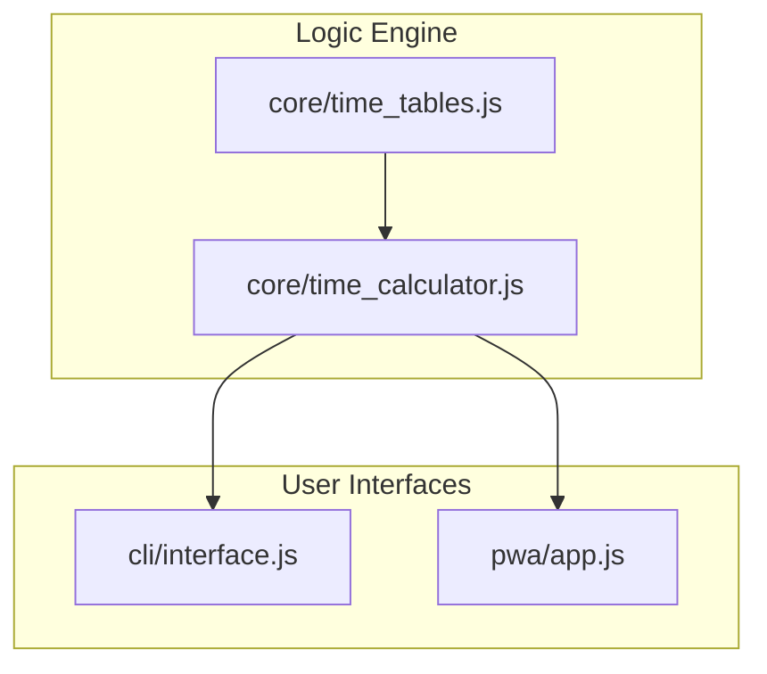

# AuraTime Code Documentation

A technical breakdown of the AuraTime codebase, architecture, and module interactions.

## 📁 File & Folder Structure

| Path | Purpose |
| :--- | :--- |
| `core/` | **Shared Core Engine**. Contains logic and data shared between CLI and PWA. |
| `core/time_tables.js` | Definitive schedule data for Rahu Kalam, Yamagandam, and Gulika Kalam. |
| `core/time_calculator.js` | Logic to parse times and determine active statuses/schedules. |
| `cli/` | **Terminal Interface**. Node.js application for interactive time tracking. |
| `cli/interface.js` | Main CLI entry point with ANSI colors, keyboard nav, and ticking clock. |
| `pwa/` | **Web Interface**. Progressive Web App for desktop and mobile browsers. |
| `pwa/index.html` | App shell and layout structure. |
| `pwa/style.css` | Premium glassmorphism UI with Dark/Light theme tokens. |
| `pwa/app.js` | UI logic, real-time clock, modal management, and theme switching. |
| `pwa/manifest.json` | PWA installation and metadata. |
| `pwa/service-worker.js` | Offline caching and PWA performance. |
| `auratime_web.bat/sh` | Automated launchers for the Web/PWA version. |
| `auratime.bat/sh` | Automated launchers for the CLI version. |

## 🏗️ High-Level Architecture

AuraTime follows a **Shared Core Logic** pattern. By isolating the time calculation engine from the UI, we ensure consistent behavior across all platforms.

## ⚙️ Core Modules & Functions

### `time_calculator.js`

| Function | Input | Output | Description |
| :--- | :--- | :--- | :--- |
| `getTimeStatus(now)` | `Date` (optional) | `Object` | The main engine. Returns the active periods, safe status, and full schedule for today. |
| `parseTime(str)` | `"HH:MM"` | `Number` | Converts time string to minutes since midnight for easy comparison. |
| `formatMinutes(min)` | `Number` | `"HH:MM"` | Converts absolute minutes back to a user-readable string. |

## 🔄 Execution Flow

1.  **Initialization**:
    *   **CLI**: Runs `main()`, sets up raw input mode for keyboard capture, and starts a 1-minute ticking interval.
    *   **PWA**: Registers the Service Worker, detects saved theme, and starts a 1-second ticking interval for the clock.
2.  **Logic Trigger**:
    *   Every interval (or on keypress), the UI calls `getTimeStatus()`.
3.  **Calculation**:
    *   `getTimeStatus` looks up the current day in `TIME_TABLES`.
    *   It iterates through Rahu, Yama, and Gulika schedules.
    *   It checks if `now` falls between `start` and `end`.
4.  **UI Render**:
    *   **CLI**: Clears the screen and reprints the ANSI-colored dashboard.
    *   **PWA**: Updates DOM elements for status, icons, colors, and the schedule list.

## 📦 Dependencies

AuraTime is designed to be extremely lightweight with **zero external runtime dependencies**.

*   **Production**: Just `Node.js` (v14+) for CLI. Browser (v2020+) for PWA.
*   **Development**: `serve` (via npx) is used to host the PWA locally for cross-folder access.
