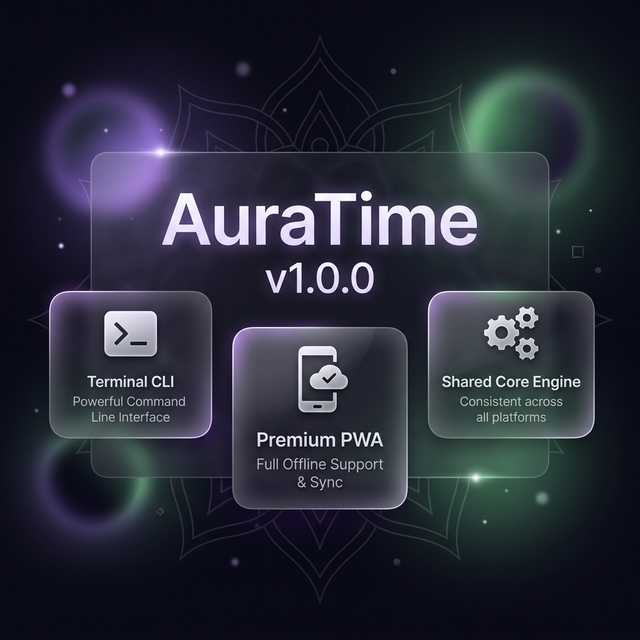

# ✦ AuraTime

<p align="center">
  
</p>

[](https://www.gnu.org/licenses/gpl-3.0)

**Good Time / Bad Time Checker**

A lightweight, cross-platform utility that instantly tells you whether the current time falls within traditionally inauspicious Vedic time periods — **Rahu Kalam**, **Yamagandam**, or **Gulika Kalam**.

Works as both a **Terminal CLI** and a **Progressive Web App (PWA)**.

---

## Features

- ⚡ **Instant results** — Know within 2 seconds of launching
- 🎨 **Color-coded status** — Green (Safe), Red (Rahu), Yellow (Yama), Purple (Gulika)
- ⌨️ **Keyboard navigation** — Press R, Y, G for explanations, arrow keys to browse
- 📱 **PWA with offline support** — Install on your phone, works without internet
- 🖥️ **Cross-platform** — Windows (.bat), Linux (.sh), macOS (.sh)
- 🕐 **24-hour time format** — Clean, unambiguous display
- 📖 **Educational** — Two-line explanations for each time period

---

## Quick Start

### CLI (Terminal)

**Windows:**
```
auratime.bat
```

**Linux / macOS:**
```bash
chmod +x auratime.sh
./auratime.sh
```

**Via npm:**
```bash
npm start          # Interactive mode
npm run check      # One-shot mode (print & exit)
```

### PWA (Browser)

**Windows:**
```
auratime_web.bat
```

**Linux / macOS:**
```bash
chmod +x auratime_web.sh
./auratime_web.sh
```

**Via npm manually:**
```bash
npm run serve
```
Then manually open [http://localhost:3003/pwa](http://localhost:3003/pwa) in your browser.

---

## CLI Controls

| Key | Action |
|-----|--------|
| `R` | View Rahu Kalam explanation |
| `Y` | View Yamagandam explanation |
| `G` | View Gulika Kalam explanation |
| `S` | Return to main schedule view |
| `↑↓` | Navigate between explanations |
| `Q` | Quit |

---

## Time Periods

| Period | Meaning |
|--------|---------|
| **Rahu Kalam** | Ruled by shadow planet Rahu. Avoid starting new ventures. |
| **Yamagandam** | Governed by Yama (deity of death/justice). Avoid auspicious activities. |
| **Gulika Kalam** | Linked to Saturn's sub-planet Gulika. Tasks may face obstacles. |

---

## ⚙️ Calculation Logic & Trade-offs

AuraTime uses a fixed **06:00 sunrise / 18:00 sunset** baseline rather than a live Ephemeris. This is a deliberate architectural decision to ensure:

- ⚡ **Instant Loading** — No complex astronomical lookups or GPS waiting times.
- 🔒 **Absolute Privacy** — We never request, store, or track your location.
- ✈️ **Offline Native** — Works anywhere on Earth without an internet connection.
- 📦 **Zero Maintenance** — No heavy external libraries or API dependencies.

*For precise religious rituals requiring exact GPS-based timings, we recommend consulting a local Panchang.*

---

## Project Structure

```
good-time-check/
├── core/
│   ├── time_tables.js      # Time period data for all 7 days
│   └── time_calculator.js   # Shared calculation engine
├── cli/
│   └── interface.js          # Terminal interface with ANSI colors
├── pwa/
│   ├── index.html            # PWA shell
│   ├── style.css             # Dark-mode glassmorphism design
│   ├── app.js                # PWA application logic
│   ├── service-worker.js     # Offline caching
│   └── manifest.json         # PWA manifest
├── auratime.bat              # Windows launcher
├── auratime.sh               # Linux/macOS launcher
├── package.json
└── README.md
```

---

## Technical Documentation

*   [Ideology & Knowledge](IDEALOGY.md) — Detailed guide on Rahu, Yama, and Gulika.
*   [Code Documentation](CODE_DOCUMENTATION.md) — Dive into the engine and module interactions.
*   [Design Philosophy](DESIGN_PHILOSOPHY.md) — Why AuraTime was built this way.
*   [Contributing](CONTRIBUTING.md) — How you can help improve the project.

---

## Requirements

- **Node.js** (v14 or later) — for the CLI
- A modern browser — for the PWA
- No other dependencies required

---

## 🔮 Future Roadmap

While AuraTime currently prioritizes speed and minimalism, we are exploring the following for future versions:

- 🛰️ **Precision Mode (Optional)**: An opt-in mode to use a live Ephemeris for location-specific sunrise/sunset calculations.
- 🛠️ **AuraTime Pro (Separate Tool)**: A more advanced version with global maps, precise GPS lookups, and detailed planetary data.
- 🔔 **Insignificant Notifications**: Desktop/Mobile alerts before a period begins.

---

## License & Copyright

Copyright (C) 2026 **Krishna Kanth B**

This project is licensed under the **GPL v3 License** - see the [LICENSE](LICENSE) file for details.
